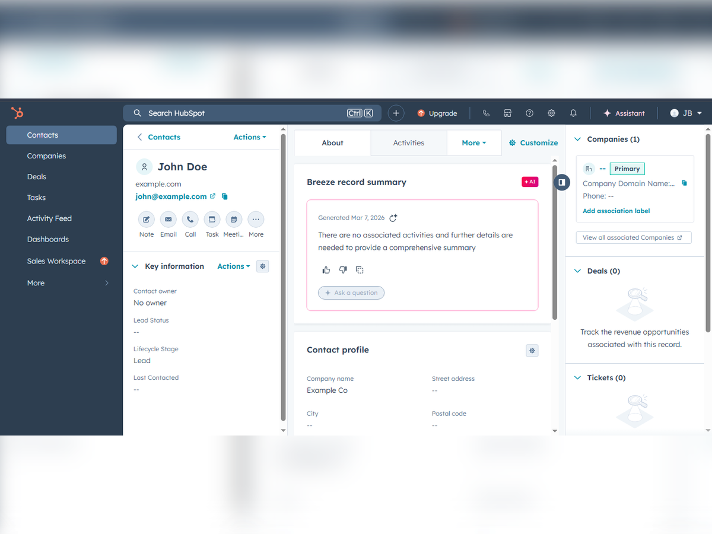

# n8n AI Lead Capture Automation

An automated lead capture system built with n8n that captures website leads, scores them with AI (HOT/WARM/COLD), and routes them instantly to CRM and team channels.

## Features
- ✅ Webhook lead capture from websites/forms
- ✅ AI lead scoring with Gemini AI
- ✅ Slack alerts for hot leads
- ✅ Google Sheets database
- ✅ HubSpot CRM integration
- ✅ Trello cards for follow-up
- ✅ Gmail auto-responder
- ✅ Error handling with Slack notifications

## Tools Used
- n8n
- Gemini AI
- Slack
- Google Sheets
- HubSpot
- Trello
- Gmail

## Results
- 20+ hours saved weekly
- Hot leads get responses in minutes
- Zero missed leads

## Screenshots

## Workflow
The `Automated Lead Capture and CRM Management System.json` file contains the complete n8n workflow. Import it into your n8n instance to use.
